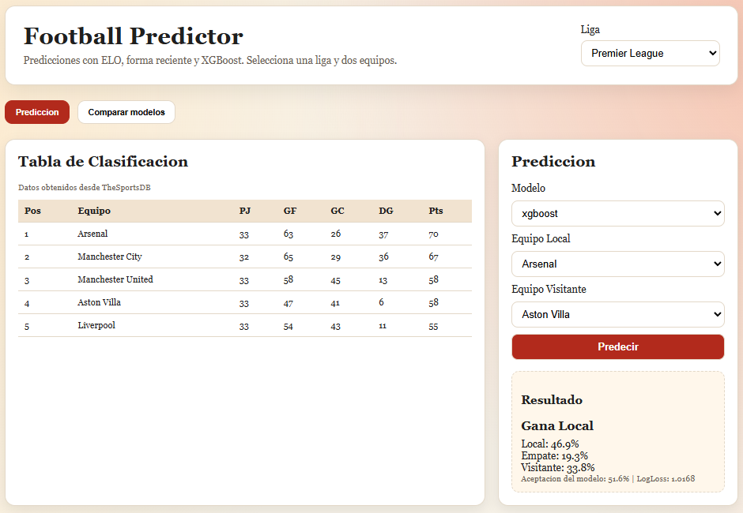
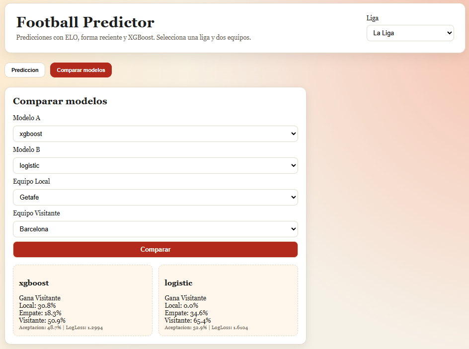

# Futbol Predictor

Aplicacion web + API construida con FastAPI para predecir resultados de partidos de futbol (H/D/A) usando features de ELO, forma reciente y modelos de machine learning.


## Caracteristicas

- Interfaz web para seleccionar liga, equipos y modelo.
- Prediccion de resultado de partido:
  - `H`: gana local
  - `D`: empate
  - `A`: gana visitante
- Comparacion entre dos modelos para el mismo partido.
- Tabla de clasificacion por liga.
- Datos historicos desde `football-data.co.uk` y tabla actual desde `TheSportsDB`.

## Stack

- Python 3.11+
- FastAPI
- Uvicorn
- Pandas / NumPy
- Scikit-learn
- XGBoost
- Jinja2

## Estructura del proyecto

```text
Futbol_predictor/
  app/
    main.py            # Endpoints FastAPI y render de la web
    data_sources.py    # Descarga/limpieza de datos y standings
    predictor.py       # Feature engineering, entrenamiento y prediccion
    schemas.py         # Esquemas Pydantic
    templates/
      index.html       # Interfaz principal
    static/
      styles.css       # Estilos
  requirements.txt
```

## Instalacion

1. Crear y activar entorno virtual:

```powershell
python -m venv .venv
.\.venv\Scripts\Activate.ps1
```

2. Instalar dependencias:

```powershell
pip install -r requirements.txt
```

## Ejecucion

Con el entorno virtual activo:

```powershell
uvicorn app.main:app --reload
```

La app quedara disponible en:

- http://127.0.0.1:8000

## Endpoints principales

- `GET /` - Interfaz web.
- `GET /api/models` - Lista de modelos disponibles.
- `GET /api/teams/{league}` - Equipos disponibles por liga.
- `GET /api/standings/{league}` - Tabla de clasificacion.
- `POST /api/predict` - Prediccion con un modelo.
- `POST /api/predict-compare` - Comparacion de 2 modelos.

## Ejemplos de uso API

### Predecir un partido

```bash
curl -X POST "http://127.0.0.1:8000/api/predict" \
  -H "Content-Type: application/json" \
  -d '{
    "league": "premier-league",
    "home_team": "Arsenal",
    "away_team": "Chelsea",
    "model": "xgboost"
  }'
```

### Comparar modelos

```bash
curl -X POST "http://127.0.0.1:8000/api/predict-compare" \
  -H "Content-Type: application/json" \
  -d '{
    "league": "la-liga",
    "home_team": "Real Madrid",
    "away_team": "Barcelona",
    "model_a": "xgboost",
    "model_b": "logistic"
  }'
```

## Ligas soportadas

- `premier-league`
- `la-liga`
- `bundesliga`
- `ligue-1`
- `serie-a`

## Notas

- La primera prediccion por liga/modelo puede tardar mas porque entrena y cachea el modelo en memoria.
- Requiere conexion a internet para obtener datos.

